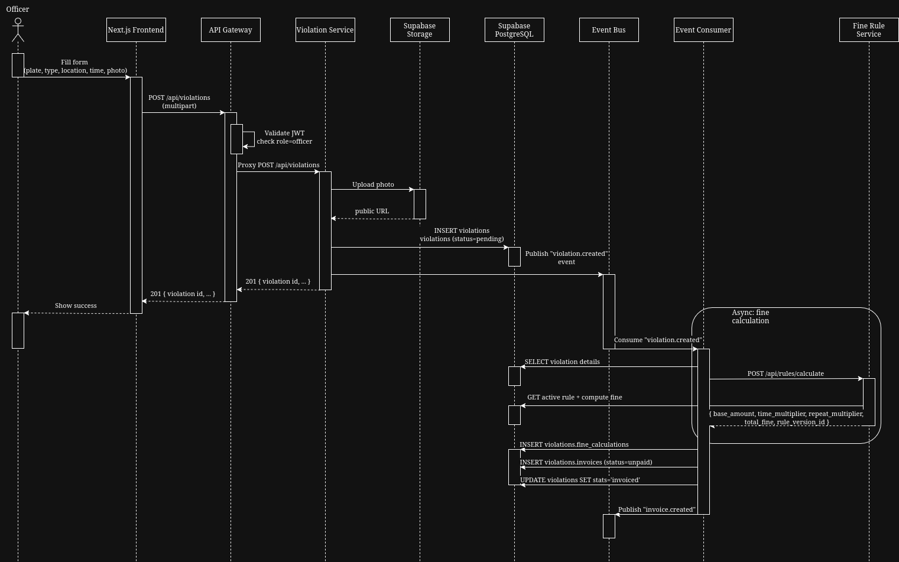
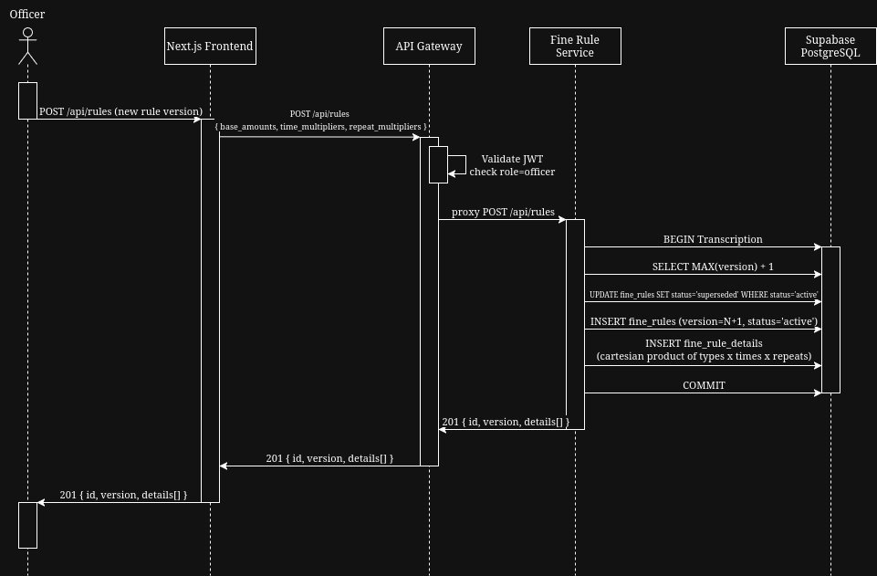
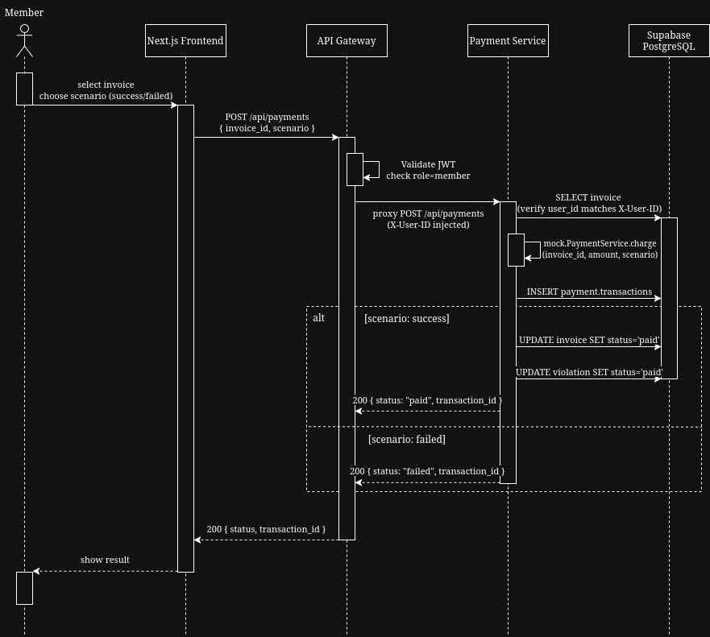
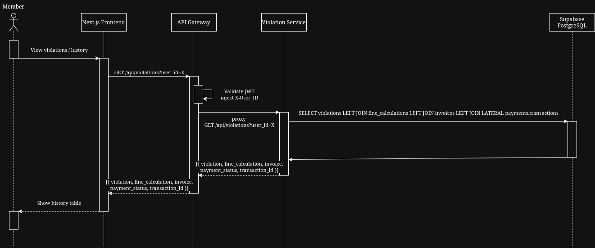
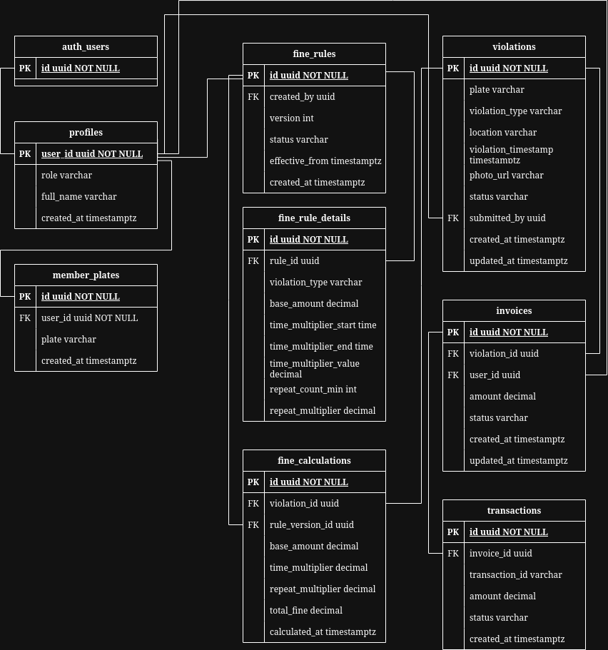

# DESIGN.md — Parking Violation Portal

## Architecture Overview

```
┌──────────┐     ┌─────────────┐     ┌───────────────┬──────────────┬──────────────┐
│  Next.js │────▶│  API Gateway │────▶│  Fine Rule    │  Violation   │  Payment     │
│ Frontend │     │  (Go, :8080) │     │  Service      │  Service     │  Service     │
│ (:3000)  │     │              │     │  (Go, :8083)  │  (Go, :8082) │  (Go, :8084) │
└──────────┘     │  JWT Auth    │     └──────┬────────┴──────┬───────┴──────┬───────┘
                 │  Role Gate   │            │               │              │
                 │  Proxy       │            │               │              │
                 └──────┬───────┘            │               │              │
                         │                    │          ┌─────────┐         │
                         │                    │          │Event Bus│         │
                         │                    │          └─────────┘         │
                        │                    │               │              │
                        ▼                    ▼               ▼              ▼
                 ┌─────────────────────────────────────────────────────────────┐
                 │                    Supabase Cloud                             │
                 │  ┌──────────┐  ┌───────────┐  ┌─────────────────────────┐   │
                 │  │  Auth    │  │PostgreSQL │  │ Object Storage (photos) │   │
                 │  └──────────┘  │   (4      │  └─────────────────────────┘   │
                 │                │ schemas)  │                                 │
                 │                └───────────┘                                 │
                 └─────────────────────────────────────────────────────────────┘
```

### Service Boundaries

| Service | Port | Responsibility | Sync/Async |
|---------|------|---------------|------------|
| API Gateway | 8080 | JWT validation, role gate, reverse proxy | Sync |
| Fine Rule Service | 8083 | Rule version CRUD, fine calculation engine | Sync |
| Violation Service | 8082 | Violation CRUD, photo upload, event bus pub/consumer | Sync + Async |
| Payment Service | 8084 | Mock charge, transaction storage | Sync |
| Frontend (Next.js) | 3000 | Officer + Member UI | Sync |

---

## Data Flow — All 5 Assignment Flows

### Flow 1: Officer Submits Violation



**Synchronous:** Photo upload, violation creation, event publish  
**Asynchronous:** Fine calculation, calculation snapshot storage, invoice creation  
**Cross-module:** Consumer calls Fine Rule Service (HTTP). Consumer writes to violations + rules schemas.

### Flow 2: System Calculates Fine (Async)

Same as the async portion of Flow 1. The Violation Service consumer:
1. Receives `violation.created` from the event bus
2. Calls `POST /api/rules/calculate` on Fine Rule Service
3. Fine Rule Service reads the active rule from `rules.fine_rules` + `rules.fine_rule_details`
4. Applies formula: `base_amount × time_multiplier × repeat_multiplier`
5. Returns result with `rule_version_id` (immutable snapshot reference)
6. Consumer stores `FineCalculation` snapshot in `violations.fine_calculations`
7. Consumer creates `Invoice` in `violations.invoices`
8. Consumer emits `invoice.created` event

### Flow 3: Officer Updates Fine Rules



**Rule versioning protects historical fines:** Each `FineCalculation` stores `rule_version_id` → `FineRule.id`. The FK to `fine_rules` has NO CASCADE DELETE. When a new rule is published, the old rule is marked `superseded` but never deleted. Existing violations maintain their original fine calculation with a reference to the exact rule version used.

### Flow 4: Member Pays Fine



### Flow 5: Transaction History



---

## Entity Relationship Diagram



### PostgreSQL Schemas

| Schema | Tables | Purpose |
|--------|--------|---------|
| `public` | `profiles`, `member_plates` | User profiles and plate-to-owner mappings |
| `rules` | `fine_rules`, `fine_rule_details` | Immutable rule versioning |
| `violations` | `violations`, `fine_calculations`, `invoices` | Violation lifecycle |
| `payments` | `transactions` | Payment transaction log |

### Key Design Decisions

1. **Rule versioning is immutable**: `fine_calculations.rule_version_id` references `fine_rules(id)` with NO CASCADE. New rule publications mark old rules as `superseded` — never delete. Each violation's fine is permanently linked to the exact rule version used at calculation time.

2. **Async fine calculation via event bus**: Officer submits a violation synchronously (gets immediate confirmation), then the consumer processes it asynchronously. This decouples the submission from the calculation and prevents slow DB queries from blocking the officer's UX. The event bus uses Go channels for in-process pub/sub, avoiding external broker dependencies.

3. **Cross-schema foreign keys**: `fine_calculations.rule_version_id → rules.fine_rules(id)` connects the violations schema to the rules schema. This is intentionally a manual FK (not in Prisma schema) to prevent accidental migrations from altering it.

4. **X-User-ID header injection**: The API Gateway validates the Supabase JWT, extracts the user ID, and injects it as `X-User-ID` into downstream service requests. Internal services trust this header — it's a trust boundary enforced by the gateway alone.
